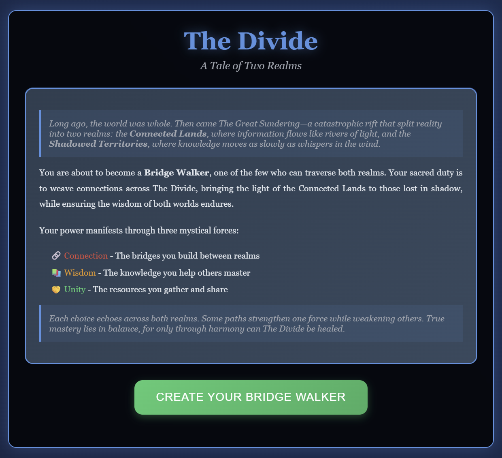

**The Divide: A Digital Equity RPG**

An interactive RPG that transforms complex digital equity policy into engaging, educational gameplay

Experience the digital divide through the eyes of a Bridge Walker—a mystical character working to heal the rift between the Connected Lands and the Shadowed Territories.

Play the Game

About The Divide:
The Divide is an educational RPG game that uses fantasy metaphors to explore real-world digital inequality challenges. Players become "Bridge Walkers" making decisions as community leaders working to address digital equity issues across different scenarios.

Key Features:

Six Unique Characters: Choose from diverse Bridge Walker avatars, each with different approaches to digital equity
Three Origin Stories: Your background shapes your starting abilities and perspective
Three Force Balance System: Manage Connection (infrastructure), Wisdom (digital literacy), and Unity (resources)
Real-World Scenarios: Fantasy quests that mirror actual digital divide challenges
AI Companion: Pixel the Digital Familiar provides guidance and real-world context
Accessibility First: Screen reader compatible, mobile responsive, low-bandwidth optimized

Educational Goals:

Develop empathy for different community perspectives on digital access
Understand the complexity and trade-offs in digital equity policy
Learn about various approaches to addressing digital inequality
Practice systems thinking about interconnected social issues
Motivate real-world civic engagement and advocacy

How to Play:

Create Your Character: Choose an avatar and origin story that shapes your approach
Navigate Scenarios: Make decisions in fantasy settings that mirror real digital equity challenges
Balance Three Forces: Manage Connection, Wisdom, and Unity to achieve your goals
Learn from Consequences: Each choice affects your community and teaches about policy trade-offs
Reflect and Discuss: Use built-in prompts to think critically about your decisions

Character Types:
| Avatar | Approach | Strengths |
|--------|----------|-----------|
| 🌉 **The Wanderer** | Balanced bridge-building | Versatile problem-solving |
| 🧙‍♀️ **The Sage** | Knowledge-focused | Education and wisdom-sharing |
| ⚡ **The Technomancer** | Innovation-driven | Technical solutions |
| 🌱 **The Cultivator** | Community-building | Grassroots organizing |
| 🛡️ **The Guardian** | Protection-focused | Advocacy and policy |
| 🎭 **The Storyteller** | Communication-centered | Cultural bridge-building |

Educational Use:
For Educators:
The Divide is designed for:

Social Studies classes exploring inequality and policy
Technology Education courses addressing digital literacy
Civic Education programs teaching community engagement
Professional Development for digital equity advocates

Classroom Integration:

Individual Play: Students experience scenarios and reflect on choices
Group Discussions: Pause at decision points for collaborative debate
Character Comparison: Different students play different avatars to compare perspectives
Research Extensions: Use scenarios as launching points for real-world policy research

Discussion Prompts:

How do your character's background and origin affect available solutions?
What trade-offs did you face when balancing the three forces?
How do the fantasy scenarios relate to real digital equity challenges?
What surprised you about the complexity of digital divide solutions?

Technical Details:
Built With:
HTML5/CSS3/JavaScript - Pure web technologies, no frameworks required
Responsive Design - Works on desktop, tablet, and mobile devices
Accessibility Features - WCAG 2.1 AA compliant for screen readers
Progressive Enhancement - Functions on older browsers and slower connections

Browser Support:

✅ Chrome/Chromium (recommended)
✅ Firefox
✅ Safari
✅ Edge
✅ Mobile browsers (iOS Safari, Chrome Mobile)

Performance:

Lightweight: < 500KB total assets
Fast Loading: Optimized for slow internet connections
No Dependencies: Runs entirely in the browser
Offline Capable: Can be downloaded and played without internet

Contributing:
We welcome contributions from educators, developers, and digital equity advocates!

Scenarios & Learning Objectives:
| Scenario | Real-World Issue | Learning Objectives |
|----------|------------------|---------------------|
| **The Isolated Village** | Rural broadband access | Infrastructure policy, cost-benefit analysis |
| **The Elders' Sanctuary** | Senior digital literacy | Intergenerational learning, accessibility |
| **The Academy of Unequal Learning** | Student device equity | Educational policy, resource allocation |
| **The Workers' Transformation** | Job displacement & training | Workforce development, economic transition |
| **The Final Convergence** | Systemic policy change | Long-term planning, institutional change |

This game is free for all educational purposes. We encourage:

Classroom use at any level
Teacher training and professional development
Community education and advocacy
Research and academic study

Roadmap:
Version 1.1 (Coming Soon)

 Additional character customization options
 Extended companion dialogue system
 Achievement and progress tracking
 Improved mobile interface

Version 2.0 (Future)

 Multiplayer collaborative scenarios
 Community scenario builder
 Data visualization dashboard
 Integration with learning management systems

Long-term Vision

 Multiple language support
 Real organization partnerships
 Advanced assessment tools
 Expanded to other social justice topics

"The path of the Bridge Walker is never easy, and your journey has shown you the true complexity of The Divide. Yet this understanding itself is valuable—for only by acknowledging the depth of the challenge can future healers hope to bridge it more successfully."
